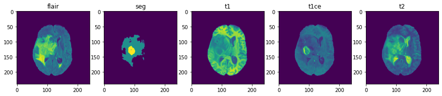
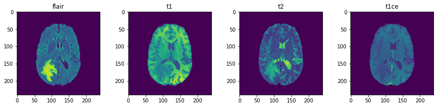
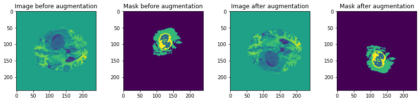
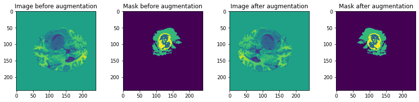
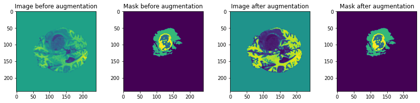
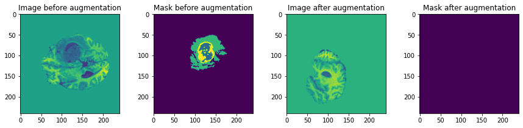
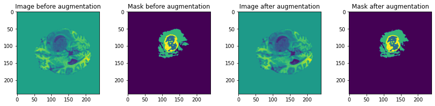
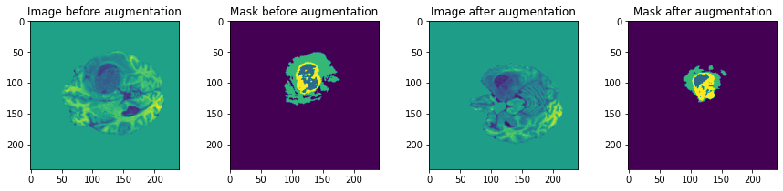
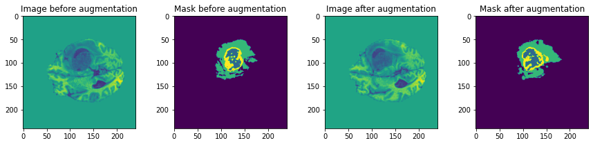

# BrainTumorSegmentation

Dataset: [BraTS2020 dataset](https://ipp.cbica.upenn.edu/categories/brats2020)

1. Training: 3D MRI images from `369` patients (Height=240, Width=240, Depth=155)
    - Images: 4 modalities 
    - Masks: 4 classes(0, 1, 2, and 4)

 

2. Validation: 3D MRI images from `125` patients (Height=240, Width=240, Depth=155)
    - Images: 4 modalities




Preprocess and Augmentation:

1. Flip



2. Brightness


3. Rotation


4. Elastic


5. Shift


6. Swirl



Requirements:
- tensorflow
- tensorflow-addons
- tensorflow-cpu
- numpy
- matplotlib
- elasticdeform
- scikit-learn
- scipy
- nibabel
- SimpleITK


Install the requirements using command below:
```bash
pip install -r requirements.txt 
```

Use the following command to see the arguments needed for running:
```bash
python -m scripts.main -h
```

For running **UNet3D** model use this:
```bash
python -m scripts.main -bs 4 -ps 32 -a 5 -ne 1 -ef 0.25 -lr 1e-3 -b1 0.9 -ds 100 -m unet
```

For running **AttUnet3D** model use this:
```bash
python -m scripts.main -bs 4 -ps 32 -a 5 -ne 1 -ef 0.25 -lr 1e-3 -b1 0.9 -ds 100 -m att_unet
```

For running **GAN** model use this:
```bash
python -m scripts.main -bs 4 -ps 32 -a 5 -ne 1 -ef 0.25 -lr 1e-3 -b1 0.9 -ds 100 -m gan
```